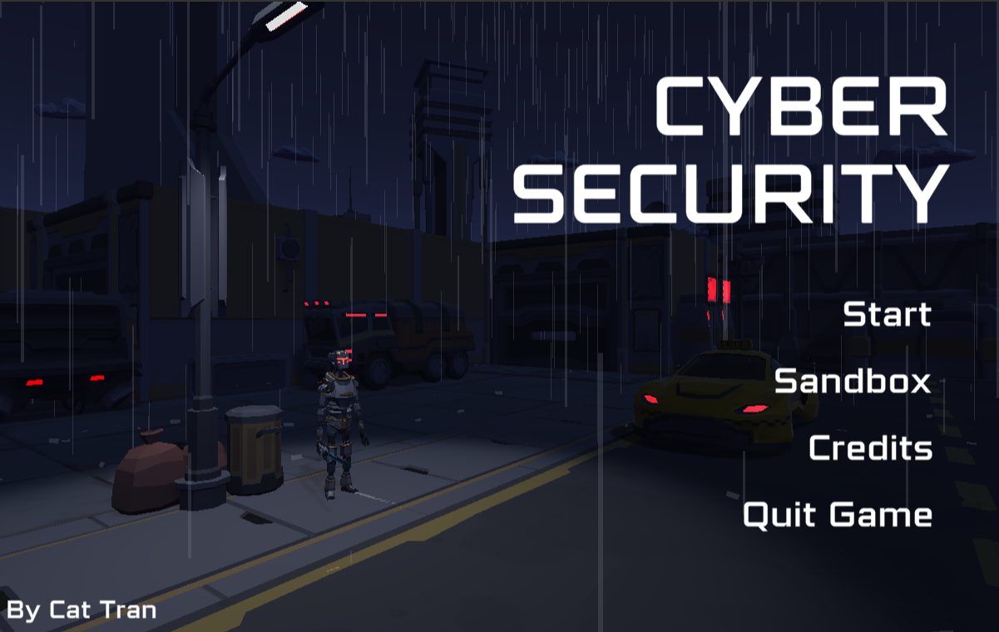

# Cyber Security 

Escape from the high security cyberpunk robotic institution center. You can wipe them all out or just make a run for it. Cyber Security is a game that was made with Unity using C#. It was then convert from desktop game into WebGL player and uploaded onto itch.io.

Control:
- Num 1 – Laser Pistol
- Num 2 – Blaster
- Num 3 – Zapper

- W,A,S,D – Move
- Space – Jump
- Hold Shift – Run
- Esc – Menu

Music:
- The High Line – Causmic A
- This_is_Not_IDM – True Cuckoo
- Today’s Plan – DJ Freedem
- West Bad – Jeremy Black

Try it out:

https://www.catcodebox.com/cyber-security/
